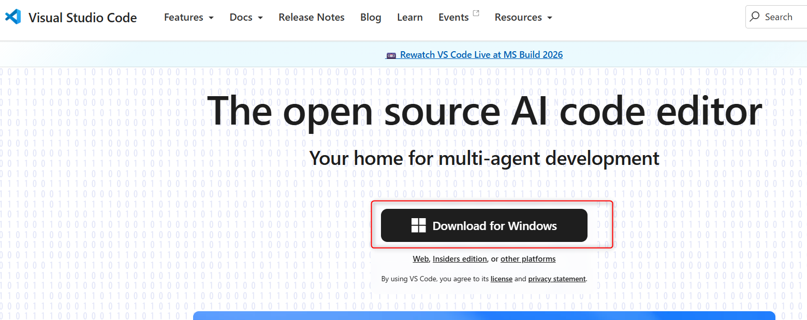
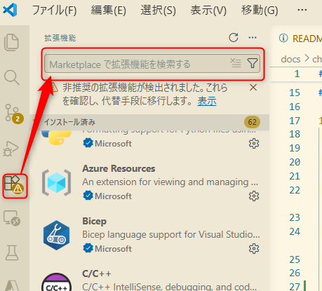
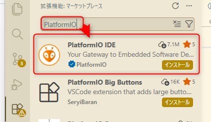
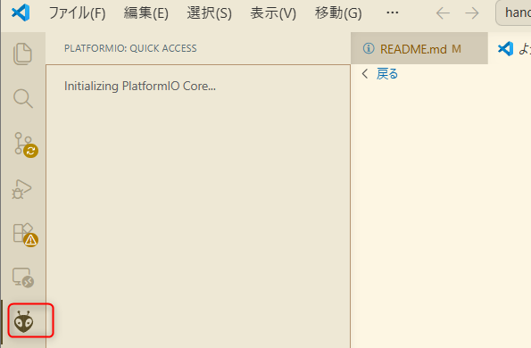

# 1: 環境構築 (VSCode/Platform.IO インストール)

この章では、WioBG770a にプログラムを書き込むための開発環境を準備します。

## 想定時間

10 分

## この章のゴール

- VSCodeとPlatform.IO をインストールする
- WioBG770a を PC に接続する
- Platform.IO の書き込み先を確認する

## 手順の下書き

1. VSCode をインストールする  
   最初に PC でコードを編集して実行させるためのIDEが必要ですので、以下のVSCodeをインストールします。

   [https://code.visualstudio.com/](https://code.visualstudio.com/)

   VSCodeは、Microsoft が開発した統合開発環境（IDE）です。拡張機能を追加することで、WioBG770a 向けの開発環境として利用できます。

   サイトに遷移し、キャプチャの通り、OSに合わせたインストーラーをダウンロードしてインストールしてください。  
   ※本手順ではWindows版を利用しています。

   

2. Platform.IO をインストールする  
   VSCode の拡張機能から Platform.IO をインストールします。  
   Platform.IO は、WioBG770a 向けの開発環境を提供する拡張機能です。
   1. VSCode の左側のメニューから「拡張機能」を選択します。
      
   2. 検索バーに「PlatformIO」と入力し、検索結果から「PlatformIO IDE」を選択します。
      
   3. 「インストール」ボタンをクリックしてインストールします。
      
      インストールが完了すると、VSCode の左下に Platform.IO のアイコンが表示されます。
      

3. WioBG770a を USB ケーブルで接続する  
   WioBG770a を USB ケーブルで PC に接続します。USB-C ケーブルを利用して、WioBG770a の USB ポートと PC の USB ポートを接続してください。
   

---

- 次: [2: hello, world で L チカ](../chapter2/README.md)
