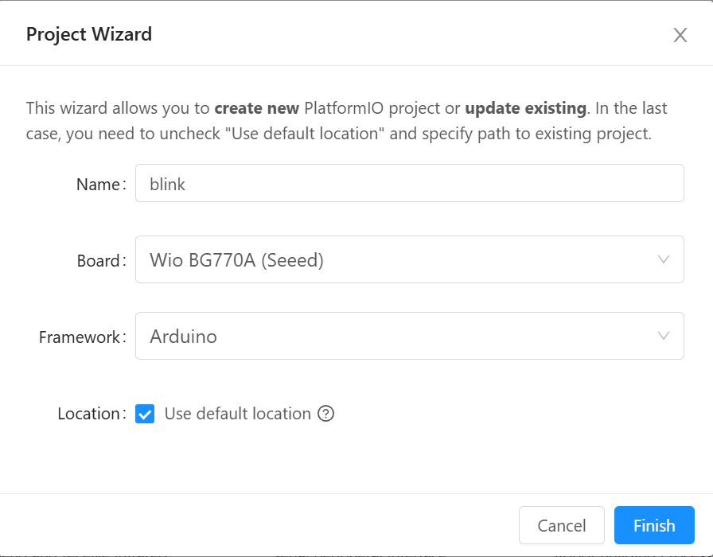
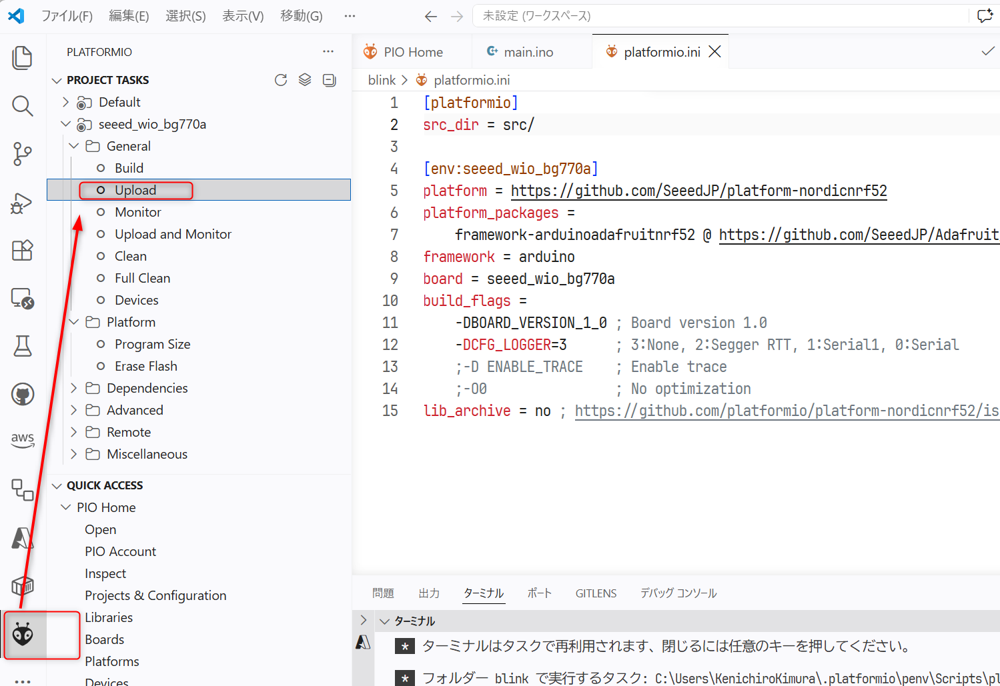
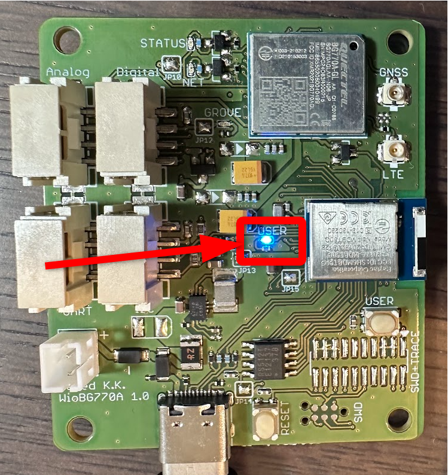

# 2: LチカでWioBG770aの動作と制御方法を理解する

この章では、最初の動作確認として LED を点滅させます。

## 想定時間

5 分

## この章のゴール

- VSCode から WioBG770a にコードを書き込む
- 最小コードで LEDを点滅(Lチカ)させ、WioBG770a を制御するプログラムの基本構造と、プログラムのビルドとアップロード方法を確認する

## 手順

WioBG770a に内蔵された LED を点滅させてみましょう。

まず、WioBG770aをUSBケーブルでPCに接続してください。

VSCodeを起動し、PlatformIO のホーム画面から「New Project」を選択してください。  
左のメニューの、PlatformIOのアイコンをクリックするか、`Ctrl+Shift+P` でコマンドパレットを開き「PlatformIO: Home」と入力して選択してください。


(*)上記VSCodeの画面は環境によって異なる場合があります。アイコン画像が表示されないといった場合はコマンドパレットを使ってください。

nameに「blink」、boardは「Wio BG770A(Seeed)」を選択し、「Finish」をクリックしてください。



以下のコードを `platformio.ini` に貼り付けてください。

```
[platformio]
src_dir = src

[env:seeed_wio_bg770a]
platform = https://github.com/SeeedJP/platform-nordicnrf52
platform_packages =
    framework-arduinoadafruitnrf52 @ https://github.com/SeeedJP/Adafruit_nRF52_Arduino.git
framework = arduino
board = seeed_wio_bg770a
build_flags =
    -DBOARD_VERSION_1_0 ; Board version 1.0
    -DCFG_LOGGER=3      ; 3:None, 2:Segger RTT, 1:Serial1, 0:Serial
    ;-D ENABLE_TRACE    ; Enable trace
    ;-O0                ; No optimization
lib_archive = no ; https://github.com/platformio/platform-nordicnrf52/issues/119
```

`src/main.cpp`を`src/main.ino`にリネームして、以下のコードを貼り付けてください。

```c
#include <Adafruit_TinyUSB.h>

void setup() {
}

void loop() {
  digitalWrite(LED_BUILTIN, HIGH);
  delay(200);
  digitalWrite(LED_BUILTIN, LOW);
  delay(800);
}
```

VSCodeのplatformIOの「Upload」を押してください。問題が発生していなければボードがビルドされ、プログラムが書き込まれます。書き込みを行うUSBポートは自動で選択されます。



アップロードに成功すると、LEDが0.2秒点灯し、0.8秒消灯する動作を繰り返します。



---
- 次: [3: SIM の開通と SORACOM Harvest Data の設定](../chapter3/README.md)
- 前: [1: 環境構築 (VSCode/Platform.IO インストール)](../chapter1/README.md)
