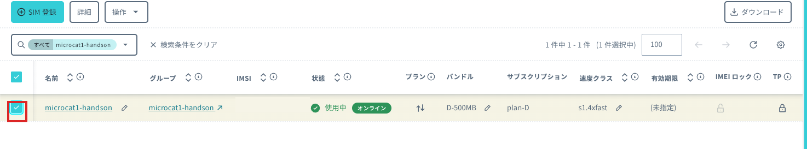
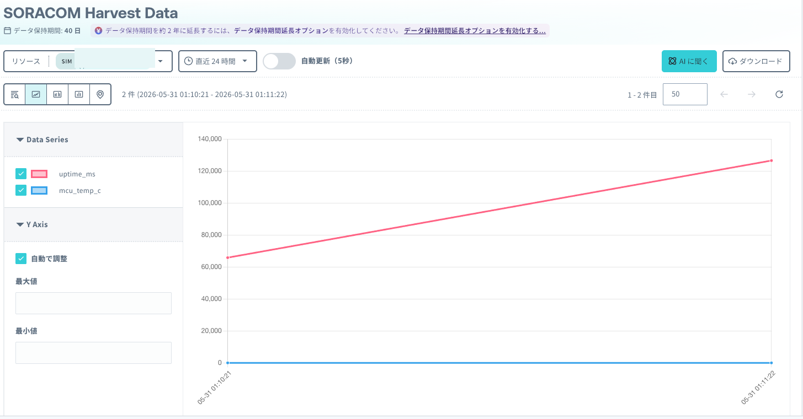

# 4: SORACOM へデータ送信して Harvest Data で確認

この章では、WioBG770a をセルラーネットワークに接続し、JSON 形式のデータを SORACOM Unified Endpoint へ送信します。送信したデータが SORACOM Harvest Data に保存されることを確認します。

## 想定時間

10 分

## この章のゴール

- WioBG770a をセルラーネットワークに接続する
- HTTP で JSON データを送信する
- SORACOM Harvest Data で受信したデータを確認する
- プログラムで送った JSON の項目とグラフの系列の対応を理解する

## 事前に確認すること

この章では、前の章で設定した SIM グループを使います。次の状態になっていることを確認してください。

- WioBG770a に SIM が正しい向きで挿入されている
- WioBG770a に LTE アンテナが接続されている
- SIM が所属するグループで SORACOM Harvest Data が `ON` になっている
- VS Code と PlatformIO から WioBG770a にプログラムを書き込める

## 1. PlatformIO の設定を変更する

[Chapter 2](../chapter2/README.md) で作成した `blink` プロジェクトを VS Code で開きます。

`platformio.ini` を次の内容に置き換えてください。セルラー通信に使う `WioCellular` と、HTTP 通信に使う `ArduinoHttpClient` を `lib_deps` に追加しています。

```ini
[platformio]
src_dir = src

[env:seeed_wio_bg770a]
platform = https://github.com/SeeedJP/platform-nordicnrf52
platform_packages =
    framework-arduinoadafruitnrf52 @ https://github.com/SeeedJP/Adafruit_nRF52_Arduino.git
framework = arduino
board = seeed_wio_bg770a
monitor_speed = 115200
build_flags =
    -DBOARD_VERSION_1_0 ; Board version 1.0
    -DCFG_LOGGER=3      ; 3:None, 2:Segger RTT, 1:Serial1, 0:Serial
lib_archive = no ; https://github.com/platformio/platform-nordicnrf52/issues/119
lib_deps =
    seeedjp/WioCellular@^0.3.15
    arduino-libraries/ArduinoHttpClient@^0.6.1
```

初回のビルドでは、PlatformIO がライブラリをダウンロードするため時間がかかる場合があります。

この章と同じ設定ファイルは [`sample/platformio.ini`](sample/platformio.ini) にもあります。

## 2. セルラー接続とデータ送信のプログラムを書く

`src/main.ino` を次の内容に置き換えてください。

```cpp
#include <Adafruit_TinyUSB.h>
#include <ArduinoHttpClient.h>
#include <WioCellular.h>

static constexpr auto SEARCH_ACCESS_TECHNOLOGY =
    WioCellularNetwork::SearchAccessTechnology::LTEM;
static constexpr auto LTEM_BAND = WioCellularNetwork::ALL_LTEM_BAND;

static const char APN[] = "soracom.io";
static const char HTTP_HOST[] = "uni.soracom.io";
static const char HTTP_PATH[] = "/";
static constexpr int HTTP_PORT = 80;

static constexpr int POWER_ON_TIMEOUT = 1000 * 20;
static constexpr int NETWORK_TIMEOUT = 1000 * 60 * 3;
static constexpr int HTTP_TIMEOUT = 1000 * 10;
static constexpr int SEND_INTERVAL = 1000 * 60;
static constexpr int CONSOLE_WAIT_TIMEOUT = 1000 * 10;

static bool connectCellular();
static bool sendToHarvest();
static void stopWithBlink();

void setup() {
  Serial.begin(115200);
  const uint32_t start = millis();
  while (!Serial && millis() - start < CONSOLE_WAIT_TIMEOUT) {
    delay(10);
  }

  pinMode(LED_BUILTIN, OUTPUT);
  digitalWrite(LED_BUILTIN, HIGH);

  Serial.println();
  Serial.println("=== Wio BG770A / SORACOM Harvest Data ===");

  if (!connectCellular()) {
    Serial.println("[ERROR] Cellular connection failed.");
    stopWithBlink();
  }

  digitalWrite(LED_BUILTIN, LOW);
  sendToHarvest();
}

void loop() {
  WioCellular.doWorkUntil(SEND_INTERVAL);
  sendToHarvest();
}

static bool connectCellular() {
  Serial.println("[1/5] Configure APN, RAT, and LTE-M band");
  WioNetwork.config.apn = APN;
  WioNetwork.config.searchAccessTechnology = SEARCH_ACCESS_TECHNOLOGY;
  WioNetwork.config.ltemBand = LTEM_BAND;

  Serial.println("[2/5] Start WioCellular");
  WioCellular.begin();

  Serial.println("[3/5] Power on BG770A");
  const auto result = WioCellular.powerOn(POWER_ON_TIMEOUT);
  if (result != WioCellularResult::Ok) {
    Serial.printf("      Failed: %s\n", WioCellularResultToString(result));
    return false;
  }

  Serial.println("[4/5] Start WioNetwork");
  WioNetwork.begin();

  Serial.println("[5/5] Wait for network registration");
  if (!WioNetwork.waitUntilCommunicationAvailable(NETWORK_TIMEOUT)) {
    Serial.println("      Timed out");
    return false;
  }

  Serial.println("[READY] Cellular connection established.");
  return true;
}

static bool sendToHarvest() {
  const String payload =
      String("{\"uptime_ms\":") + millis() +
      ",\"mcu_temp_c\":" + String(readCPUTemperature(), 1) + "}";

  Serial.println();
  Serial.printf("[HTTP] POST http://%s%s\n", HTTP_HOST, HTTP_PATH);
  Serial.printf("       Payload: %s\n", payload.c_str());

  WioCellularArduinoTcpClient<WioCellularModule> tcpClient{
      WioCellular, WioNetwork.config.pdpContextId};
  HttpClient httpClient{tcpClient, HTTP_HOST, HTTP_PORT};
  httpClient.setTimeout(HTTP_TIMEOUT);

  const int error =
      httpClient.post(HTTP_PATH, "application/json", payload.c_str());
  if (error != 0) {
    Serial.printf("[ERROR] HTTP POST failed: %d\n", error);
    httpClient.stop();
    return false;
  }

  const int statusCode = httpClient.responseStatusCode();
  const String responseBody = httpClient.responseBody();
  httpClient.stop();

  Serial.printf("[HTTP] Status code: %d\n", statusCode);
  if (responseBody.length() > 0) {
    Serial.printf("       Response: %s\n", responseBody.c_str());
  }

  if (statusCode >= 200 && statusCode < 300) {
    Serial.println("[SUCCESS] Data was accepted by Unified Endpoint.");
    return true;
  }

  Serial.println("[ERROR] Unexpected HTTP status code.");
  return false;
}

static void stopWithBlink() {
  while (true) {
    digitalWrite(LED_BUILTIN, !digitalRead(LED_BUILTIN));
    delay(500);
  }
}
```

この章と同じプログラムは [`sample/src/main.ino`](sample/src/main.ino) にもあります。

## 3. プログラムを実行する

WioBG770a を USB ケーブルで PC に接続します。PlatformIO の **Upload and Monitor** を実行して、プログラムの書き込みとシリアルモニターの起動を行ってください。

セルラー接続には数分かかる場合があります。接続とデータ送信に成功すると、シリアルモニターに次のようなログが表示されます。

```text
=== Wio BG770A / SORACOM Harvest Data ===
[1/5] Configure APN, RAT, and LTE-M band
[2/5] Start WioCellular
[3/5] Power on BG770A
[4/5] Start WioNetwork
[5/5] Wait for network registration
[READY] Cellular connection established.

[HTTP] POST http://uni.soracom.io/
       Payload: {"uptime_ms":65432,"mcu_temp_c":24.5}
[HTTP] Status code: 201
[SUCCESS] Data was accepted by Unified Endpoint.
```

この章の設定では、`Status code: 201` と表示されれば Unified Endpoint がデータを受け付けています。レスポンス設定によっては、別の `2xx` が返る場合もあります。

## 4. コード解説

このプログラムは次の順序で動作します。

1. APN に `soracom.io`、通信方式に LTE-M を設定する
2. BG770A の電源を入れる
3. セルラーネットワークに接続する
4. 稼働時間 `uptime_ms` とチップ内部温度 `mcu_temp_c` を JSON にする
5. `http://uni.soracom.io/` に HTTP POST する
6. 1 分ごとに手順 4 と 5 を繰り返す

### セルラーネットワークに接続する

`connectCellular()` は、ログの `[1/5]` から `[5/5]` に対応する処理です。

```cpp
WioNetwork.config.apn = APN;
WioNetwork.config.searchAccessTechnology = SEARCH_ACCESS_TECHNOLOGY;
WioNetwork.config.ltemBand = LTEM_BAND;
```

最初に、SORACOM Air for セルラーの APN `soracom.io`、通信方式の LTE-M、利用する LTE-M の周波数帯を設定します。`ALL_LTEM_BAND` を指定すると、WioCellular が対応する LTE-M の周波数帯を検索します。

```cpp
WioCellular.begin();
WioCellular.powerOn(POWER_ON_TIMEOUT);
WioNetwork.begin();
WioNetwork.waitUntilCommunicationAvailable(NETWORK_TIMEOUT);
```

続いて、次の順序で BG770A とネットワークを初期化します。

- `WioCellular.begin()` で WioCellular ライブラリを初期化する
- `WioCellular.powerOn()` で BG770A の電源を入れる
- `WioNetwork.begin()` でネットワーク接続処理を開始する
- `WioNetwork.waitUntilCommunicationAvailable()` で通信可能になるまで待つ

`[READY] Cellular connection established.` が表示されると、セルラーネットワーク経由でデータを送信できる状態です。

### 送信する JSON を作る

`sendToHarvest()` の先頭で、稼働時間とチップ内部温度を JSON 形式の文字列にします。

```cpp
const String payload =
    String("{\"uptime_ms\":") + millis() +
    ",\"mcu_temp_c\":" + String(readCPUTemperature(), 1) + "}";
```

- `millis()` は、WioBG770a が起動してからの経過時間をミリ秒で返す
- `readCPUTemperature()` は、nRF52840 のチップ内部温度を返す
- `String(..., 1)` は、温度を小数点以下 1 桁の文字列にする

生成される JSON は次の形式です。

```json
{"uptime_ms":65432,"mcu_temp_c":24.5}
```

> [!NOTE]
> `mcu_temp_c` は nRF52840 のチップ内部温度です。室温を正確に測るための値ではありません。外部センサーの値を送る方法は次の章で扱います。

### Unified Endpoint へ HTTP POST する

`WioCellularArduinoTcpClient` は BG770A のセルラー通信を Arduino の `Client` として扱うためのクラスです。この TCP クライアントを `HttpClient` に渡して、HTTP 通信を行います。

```cpp
WioCellularArduinoTcpClient<WioCellularModule> tcpClient{
    WioCellular, WioNetwork.config.pdpContextId};
HttpClient httpClient{tcpClient, HTTP_HOST, HTTP_PORT};

const int error =
    httpClient.post(HTTP_PATH, "application/json", payload.c_str());
```

`httpClient.post()` は、`Content-Type: application/json` を指定して `http://uni.soracom.io/` に JSON を送信します。Unified Endpoint は、SIM が所属するグループで有効になっている SORACOM Harvest Data にデータを転送します。

`httpClient.responseStatusCode()` で HTTP ステータスコードを取得し、`200` 以上 `300` 未満なら送信成功として扱います。この章の設定では通常 `201` が返ります。

### 1 分ごとに送信する

セルラー接続直後は `setup()` から `sendToHarvest()` を呼び出して、最初のデータを送信します。2 回目以降は `loop()` で 1 分待ってから送信します。

```cpp
void loop() {
  WioCellular.doWorkUntil(SEND_INTERVAL);
  sendToHarvest();
}
```

`WioCellular.doWorkUntil()` は、BG770A からの通知を処理しながら `SEND_INTERVAL` で指定した時間だけ待機します。このプログラムでは `SEND_INTERVAL` を 1 分に設定しています。

## 5. Harvest Data で確認する

[SORACOM ユーザーコンソール](https://console.soracom.io/) で **SIM 管理** を開き、WioBG770a に挿入した SIM にチェックを入れます。



**操作** をクリックし、**ログと診断** の **Harvest Data を表示** をクリックします。

SORACOM Harvest Data の画面が開いたら、必要に応じて画面を再読み込みします。送信した JSON の `uptime_ms` と `mcu_temp_c` が Data Series に表示され、グラフに値が追加されることを確認してください。



グラフ表示や表示範囲の変更など、詳しい画面操作は [Harvest Data に保存したデータを確認する](https://users.soracom.io/ja-jp/docs/harvest/visualize/) を参照してください。

## FAQ

### ビルド時にライブラリが見つからない

初回のビルドではライブラリのダウンロードに時間がかかります。PlatformIO の処理が完了するまで待ってから、もう一度ビルドしてください。それでも解決しない場合は、`platformio.ini` の `lib_deps` がこの章の内容と一致していることを確認します。

### `Power on BG770A` で失敗する

SIM の向き、USB ケーブル、LTE アンテナの接続を確認してから、WioBG770a のリセットボタンを押してください。

### `Wait for network registration` でタイムアウトする

電波状況の良い場所へ移動し、もう一度実行してください。前の章で SIM を登録し、ハンズオン用グループに所属させていることも確認します。

### HTTP のステータスコードが `2xx` にならない

シリアルモニターに `[READY]` が表示されていることを確認してください。接続済みでも失敗する場合は、SIM が所属するグループで SORACOM Harvest Data が `ON` になっていることを確認します。

### Harvest Data にデータが表示されない

WioBG770a に挿入した SIM を選んでいるか、SIM が Harvest Data を有効化したグループに所属しているか確認してください。画面を再読み込みし、表示範囲を **直近 1 時間** などに変更してから、もう一度確認します。

## 参考

- [Wio BG770AとSORACOM 入門: LTE接続編](https://zenn.dev/takao2704/articles/getting-started-with-wiobg770a_soracom2)
- [Wio BG770AとSORACOM 入門: 通信＆センサデータ取得編](https://zenn.dev/takao2704/articles/getting-started-with-wiobg770a_soracom3)
- [データを SORACOM Harvest Data に送信する](https://users.soracom.io/ja-jp/guides/getting-started/send-data-to-harvest-data/)

---
- 次: [5a: 追加コンテンツ - 省電力してみる](../chapter5a/README.md)
- 前: [3: SIM の開通と SORACOM Harvest Data の設定](../chapter3/README.md)
