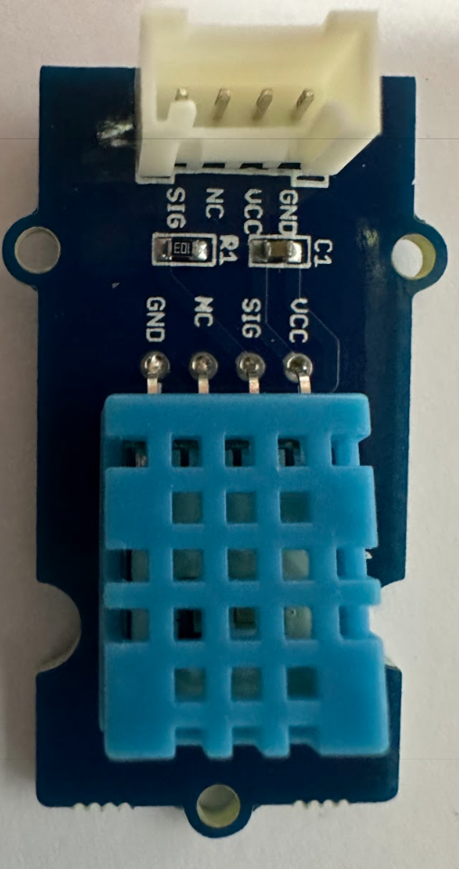
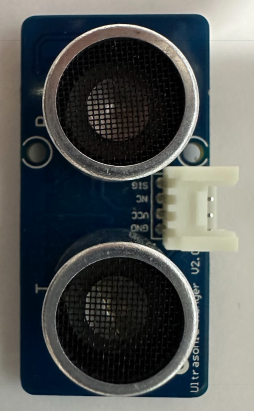

# 5: 追加コンテンツ - センサーをつないでみる

早めに完了した人向けの追加コンテンツです。外部センサーを接続し、取得した値を送信してみます。

全てのセンサーを順に試す必要はありませんので、興味のあるセンサーから試してみてください。

## この章のゴール

- センサー接続の発展課題に取り組む
- 取得したセンサーデータを WioBG770a から送信する
- 送信結果を Harvest で再確認する

今回利用するセンサーは、いずれもGroveという規格のコネクタを使用しているため、Grove コネクタを持つセンサーシールドやブレイクアウトボードを使用して接続することができます。

## 1. 温湿度センサー

温湿度センサーを繋いでみましょう。

正常に取得できたら、chapter4のプログラムと組み合わせて、このデータをSORACOMへ送信してみましょう。

## 2. 距離センサー

超音波を使って物体までの距離を測定するセンサーを繋いでみましょう。

センサーの前に物体を置いてみて、表示されるセンサーの値が変わることを確認します。

正常に取得できたら、chapter4のプログラムと組み合わせて、このデータをSORACOMへ送信してみましょう。

---
- 次: [6: あとかたづけと注意事項](../chapter6/README.md)
- 前: [4: SORACOM へデータ送信して Harvest で確認](../chapter4/README.md)
