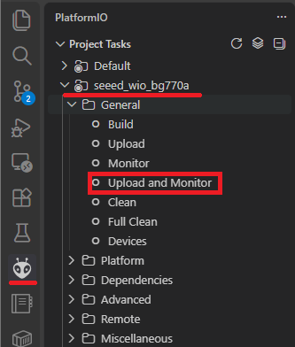
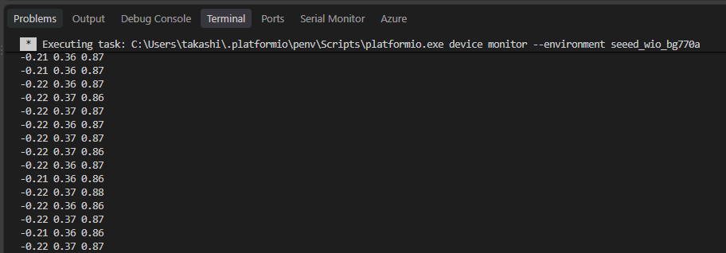
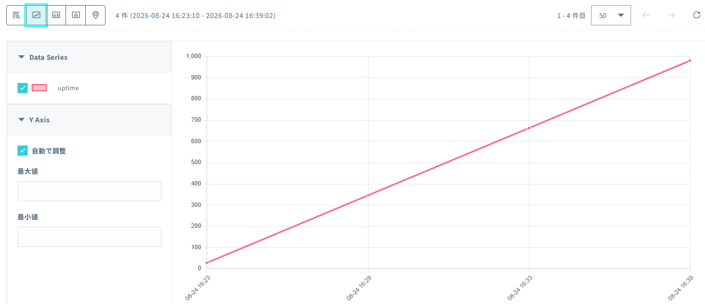

# 5A: 追加コンテンツ - 省電力してみる

この章では、Wio BG770A で省電力の考え方と実装を体験します。

省電力は電池駆動の IoT 機器にとって非常に重要なポイントです。
長時間にわたって動作させるには、ハードウェアの設計だけでなく、ソフトウェア側の制御方法も工夫する必要があります。
この章では、センサー・セルラー通信・マイコンそれぞれの電力消費を見直し、どうすれば効率よく電力を節約できるかを学びます。

## 想定時間

xx 分

## この章のゴール

- 省電力の基本的な考え方を理解する
- センサー側の電源制御のポイントを学ぶ
- セルラー通信の省電力手法を理解する

## 1. 省電力のアプローチ

Wio BG770A は、電池駆動で長時間運用できることを目指した製品です。
これを実現するには、ハードウェアの性能だけでなく、ソフトウェア設計の工夫が大切になります。

たとえば、食器を洗うときの水の量を想像してみてください。
水をジャージャーと流しっぱなしで洗うようなことはしませんよね。
必要以上に大量の水を使ってしまうと、無駄になってしまいますし、何よりもったいないです。
水の量を抑える方法として、シャワーのノズルを使うという手もありますが、それでもずっとチョロチョロと流れていると、積もり積もって大きな消費になってしまいます。

セルラー通信デバイスにおいて、もっとも正しいアプローチは「とにかく、センサーとセルラーの電源を切ること」です。
電源を切ってしまえば、チョロチョロな消費はなくなります。休止時間と比較して動作時間が短いほど、効果は大きくなります。
本来、IoT 機器の省電力設計では「動作させるタイミングを減らす」「動作時間を短くする」「不要な機能を止める」という考え方が基本です。

それでは、実際にセンサーとセルラーの電源を切る方法を試してみましょう。

## 2. センサーの省電力

外部センサーは、必要なときだけ有効にし、余計な時間は休止させることで電力消費を抑えられます。
たとえば、温湿度センサーや距離センサーなどは、測定のたびに電源を入れて短時間だけ動作させる設計にするのが有効です。
センサーの値が必要ない期間は、電源をオフにして待機時間を増やすことで、電池寿命を大きく延ばすことができます。

### 加速度センサーを動かす

まずは、サンプルスケッチ `grove-accelerometer` の `2-1` をそのまま実行し、加速度センサーの値を確認します。

1. Wio BG770AのGrove-I2Cコネクタに、Grove-ADXL345を結線してください。（USBコネクタは外しておいてね。）
2. サンプルスケッチをローカルにクローンしてください。
    ```
    cd c:/work
    git clone https://github.com/soracomug/hands-on-wiobg770a
    cd hands-on-wiobg770a
    ```
3. サンプルスケッチをVSCodeで開いてください。
    ```
    code ./docs/chapter5a/examples/2-1/grove-accelerometer
    ```
4. PlatformIOでビルドして、Wio BG770Aにアップロードしてください。  
    <a href="image/1.png"></a>

Terminalに加速度のX軸、Y軸、Z軸の値が、スペース区切りで3つ表示されていれば正常に動作しています。

<a href="image/2.png"></a>

### 周期を延ばす

測定間隔を長くすることで、センサーの読み取り回数を減らし、電力消費を抑える方法を試します。

`2-1` のサンプルスケッチでは、センサーの値を約100ミリ秒間隔で読み取っています。
具体的には、`loop()` 内でセンサーを読み取り、`INTERVAL`（100ミリ秒）の時間待つ処理を繰り返しています。
```cpp
#define INTERVAL (100)

void loop() {
  ...
  AccelReadXYZ(&x, &y, &z);
  ...
  delay(INTERVAL);
}
```

周期を延ばすには、`INTERVAL` の値を増やします。待ち時間が長くなるため、測定間隔も長くなります。

1. `2-1` のサンプルスケッチを変更してください。  
    **変更前:**
    ```cpp
    #define INTERVAL (100)
    ```
    **変更後:**
    ```cpp
    #define INTERVAL (5000)
    ```
2. PlatformIOでビルドして、Wio BG770Aにアップロードしてください。

測定間隔が約5秒になり、変更前よりもゆっくり値が表示されれば正常です。

### センサーの電源をオフする

不要なときはセンサーの電源を切ることで、待機時の消費電力を減らし、省電力設計の基本を体験します。

`2-2` では、起動時にセンサーの電源をオンにしてから、プログラムが終了するまで電源を入れたままにしています。
`2-3` では、測定するときだけセンサーの電源をオンにし、読み取りが終わったらI2C通信を終了してから電源をオフにします。
これにより、次の測定までセンサーの電源を切った状態にできます。

1. `2-2` のサンプルスケッチを開いてください。
2. `setup()` 内にある次の処理を削除します。これらは `loop()` 内へ移動してください。
    ```cpp
    digitalWrite(PIN_VGROVE_ENABLE, VGROVE_ENABLE_ON);
    delay(2 + 2);

    AccelInitialize();
    ```
3. `loop()` の先頭に、センサーの電源をオンにして初期化する処理を追加してください。
    ```cpp
    digitalWrite(PIN_VGROVE_ENABLE, VGROVE_ENABLE_ON);
    delay(2 + 2);

    AccelInitialize();
    delay(50);
    ```
4. `AccelReadXYZ()` の直後にI2C通信を終了し、センサーの電源をオフにする処理を追加してください。
    ```cpp
    AccelReadXYZ(&x, &y, &z);

    AccelDeinitialize();
    digitalWrite(PIN_VGROVE_ENABLE, VGROVE_ENABLE_OFF);
    ```
5. `AccelDeinitialize()` 関数を追加してください。
    ```cpp
    void AccelDeinitialize() {
      Wire.end();
    }
    ```
6. PlatformIOでビルドして、Wio BG770Aにアップロードしてください。`2-2` と同じように約5秒間隔で値が表示され、次の測定までセンサーの電源がオフになります。

> 完成版は `docs/chapter5a/examples/2-3/grove-accelerometer` にあります。

## 3. セルラーの省電力

セルラー通信は、通信そのものに大きな電力が必要になるため、送信の頻度や時間を抑えることが省電力設計の基本になります。
たとえば、センサー値をリアルタイムに常時送るのではなく、必要なタイミングだけまとめて送信する方法が有効です。
通信回数を減らすだけでなく、データ量を小さくする、送信時刻を工夫する、通信前に必要な検証を省くなど、設計の見直しで効果が出やすい領域です。

Wio BG770A のようなセルラー対応デバイスでは、通信の待ち時間や再接続のコストも無視できません。通信を発生させる前に「本当に送る必要があるか」を考えることが、最も大切なポイントです。

### Harvest Data へ送信する

センサーの測定結果を送信する前に、セルラー通信でデータを送信する基本的な動作を確認します。`3-1` のサンプルスケッチでは、起動時にセルラーモジュールの電源をオンにして通信可能になるまで待ち、その後5分間隔で経過時間を送信します。

1. `docs/chapter5a/examples/3-1/soracom-uptime` のサンプルスケッチをVSCodeで開いてください。
2. PlatformIOでビルドして、Wio BG770Aにアップロードしてください。
3. Terminalに `### Measuring`、`### Sending`、送信先 `uni.soracom.io:23080` などが表示されることを確認してください。
4. SORACOMユーザーコンソールで、対象SIMの **Harvest Dataを表示** を開き、`uptime` の値が保存されていることを確認してください。  
    <a href="image/3.png"></a>

`3-1` ではセルラーモジュールの電源を入れたまま、通信可能な状態を維持します。次は、送信が終わったらセルラーモジュールの電源をオフにする構成へ変更します。

### セルラーの電源をオフする

通信が不要なときはセルラーモジュールの電源を切ることで、待機時の消費電力を抑えます。`3-2` では、測定と送信のたびにセルラーモジュールをオンにし、送信後にネットワークを終了してから電源をオフにします。

1. `3-1` のサンプルスケッチを開いてください。  
2. `setup()` 内の次の処理を削除します。セルラーモジュールの電源オンとネットワーク開始は、毎回の送信前に行うため、`loop()` 内へ移動します。
        ```cpp
        if (WioCellular.powerOn(POWER_ON_TIMEOUT) != WioCellularResult::Ok) abort();
        WioNetwork.begin();

        if (!WioNetwork.waitUntilCommunicationAvailable(NETWORK_TIMEOUT)) abort();
        ```
3. `loop()` の送信処理の前に、次の処理を追加します。
        ```cpp
        if (WioCellular.powerOn(POWER_ON_TIMEOUT) != WioCellularResult::Ok) abort();
        WioNetwork.begin();

        if (WioNetwork.waitUntilCommunicationAvailable(NETWORK_TIMEOUT)) {
            JsonDoc.clear();
            if (measure(JsonDoc)) {
                send(JsonDoc);
            }
        }
        ```
4. 送信処理の後に、ネットワークとセルラーモジュールを終了する処理を追加します。
        ```cpp
        WioCellular.doWorkUntil(3000);
        WioNetwork.end();
        if (WioCellular.powerOff() != WioCellularResult::Ok) abort();
        ```
5. PlatformIOでビルドして、Wio BG770Aにアップロードしてください。`3-1` と同じように `uptime` がHarvest Dataへ送信され、送信後はセルラーモジュールの電源がオフになります。

> 完成版は `docs/chapter5a/examples/3-2/soracom-uptime` にあります。

---
- 次: [6: あとかたづけと注意事項](../chapter6/README.md)
- 前: [5: 追加コンテンツ - センサーをつないでみる](../chapter5/README.md)
